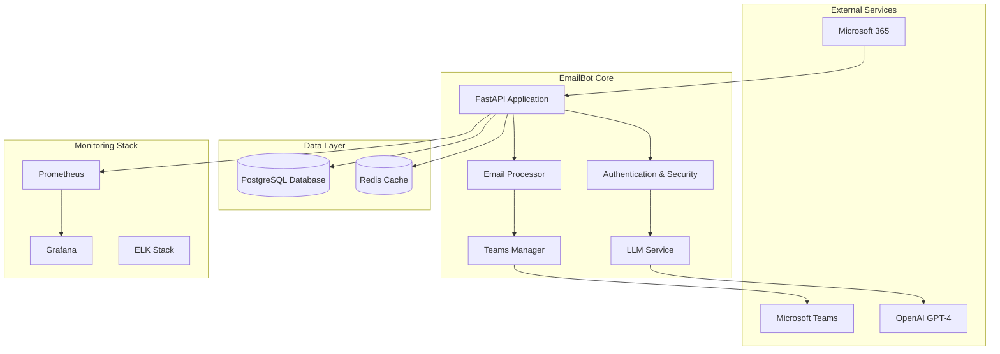

# EmailBot - AI-Powered Email Classification and Response System

**Version**: 2.0  
**Status**: Production Ready  
**Last Updated**: January 2025

## 🎯 Overview

EmailBot is a comprehensive AI-powered email classification and response system designed for enterprise IT departments. It automatically processes incoming emails, classifies them using OpenAI GPT-4, routes them to appropriate teams, and manages escalations through Microsoft Teams.

### Key Features

- **🤖 AI-Powered Classification**: Uses OpenAI GPT-4 for accurate email categorization
- **📧 M365 Integration**: Seamless integration with Microsoft 365 and Teams
- **🔒 Enterprise Security**: End-to-end encryption, audit logging, and access controls
- **📊 Advanced Monitoring**: Real-time metrics, alerting, and performance dashboards
- **🔄 Automated Workflows**: Confidence-based routing and response generation
- **🛡️ Security Compliance**: GDPR/SOC2 compliant with comprehensive audit trails
- **⚡ High Performance**: Async processing pipeline with Redis caching
- **🐳 Production Ready**: Docker containerization with full monitoring stack

## 🏗️ Architecture



## 🚀 Quick Start

### Prerequisites

- Docker and Docker Compose
- Python 3.11+
- PostgreSQL 15+
- Redis 7+
- Microsoft 365 tenant with admin access
- OpenAI API key

### 1. Clone and Setup

```bash
git clone https://github.com/yourusername/emailprocer.git
cd emailprocer
cp env.example .env
cp test.env.example test.env
# Edit .env with your configuration (see SETUP.md for details)
```

### 2. Configure Environment

**See [SETUP.md](SETUP.md) for detailed configuration instructions.**

Quick configuration example:
```bash
# Required Environment Variables (replace with your actual values)
POSTGRES_PASSWORD=your_secure_password
REDIS_PASSWORD=your_redis_password
OPENAI_API_KEY=your_openai_api_key
M365_TENANT_ID=your_tenant_id
M365_CLIENT_ID=your_client_id
M365_CLIENT_SECRET=your_client_secret
EMAILBOT_TARGET_MAILBOX=your-email@your-domain.com
MASTER_ENCRYPTION_KEY=your_32_byte_key
JWT_SECRET_KEY=your_jwt_secret
```

### 3. Deploy with Docker

```bash
# Start all services with Docker
docker-compose up -d

# Check service status
docker-compose ps

# View logs
docker-compose logs -f emailbot
```

### 4. Create Admin API Key

```bash
python scripts/operational_tools.py generate-api-key \
  --user-id "admin@your-domain.com" \
  --role "admin" \
  --expires-days 365
```

### 5. Access Services

- **EmailBot API**: http://localhost:8000
- **API Documentation**: http://localhost:8000/docs
- **Grafana Dashboard**: http://localhost:3000 (admin/your_grafana_password)
- **Prometheus Metrics**: http://localhost:9090

## 📋 API Reference

### Authentication

All API endpoints (except health checks) require Bearer token authentication:

```bash
curl -H "Authorization: Bearer YOUR_API_KEY" \
     http://localhost:8000/api/endpoint
```

### Core Endpoints

#### Email Processing
- `POST /process/trigger` - Trigger email processing
- `POST /process/immediate` - Process emails immediately
- `GET /process/status` - Get processing status
- `GET /process/statistics` - Get detailed statistics

#### Monitoring
- `GET /monitoring/status` - Get monitoring status and alerts
- `GET /monitoring/metrics` - Get performance metrics
- `POST /monitoring/alert-test` - Test alert system

#### Security Management
- `POST /security/api-keys` - Create new API key
- `DELETE /security/api-keys/{key_id}` - Revoke API key
- `GET /security/audit-logs` - Get audit logs
- `POST /security/validate-content` - Validate content security

#### Analytics
- `GET /analytics/dashboard` - Dashboard analytics
- `GET /analytics/processing` - Processing analytics
- `GET /analytics/classification` - Classification metrics
- `GET /analytics/patterns` - Pattern analysis

## 🔒 Security Features

### Authentication & Authorization
- **JWT-based API keys** with role-based permissions
- **Multi-factor authentication** for admin access
- **Rate limiting** and request throttling
- **IP whitelisting** support

### Data Protection
- **End-to-end encryption** using AES-256
- **Field-level encryption** for sensitive data
- **Secure key management** with rotation support
- **Data anonymization** for compliance

### Audit & Compliance
- **Comprehensive audit logging** for all operations
- **Encrypted audit trails** with tamper detection
- **GDPR compliance** with data retention policies
- **SOC2 controls** implementation

### Security Monitoring
- **Real-time threat detection**
- **Anomaly detection** for unusual patterns
- **Security alerts** via webhooks
- **Automated incident response**

## 📊 Monitoring & Observability

### Metrics Collection
- **Application metrics** (response times, error rates)
- **Business metrics** (email processing rates, classification accuracy)
- **Infrastructure metrics** (CPU, memory, disk usage)
- **Custom metrics** via Prometheus integration

### Alerting
- **Configurable thresholds** for all metrics
- **Multi-channel alerting** (email, Slack, webhooks)
- **Alert escalation** with acknowledgment tracking
- **Smart alert grouping** to reduce noise

### Dashboards
- **Real-time dashboards** with Grafana
- **Executive summary** views
- **Operational dashboards** for monitoring
- **Performance analytics** for optimization

### Logging
- **Structured logging** with JSON format
- **Centralized log aggregation** with ELK stack
- **Log correlation** across services
- **Secure log retention** with encryption

## 🛠️ Operations

### Daily Operations

```bash
# Health check
python scripts/operational_tools.py health-check --detailed

# Performance report
python scripts/operational_tools.py performance-report --hours 24

# Security audit
python scripts/operational_tools.py security-audit

# Clean cache
python scripts/operational_tools.py clean-cache
```

### Backup & Recovery

```bash
# Create backup
python scripts/operational_tools.py backup-database

# Restore from backup
python scripts/operational_tools.py restore-database --backup-file backup_name.sql.gz

# List backups
ls -la backups/
```

### Maintenance

```bash
# Rotate logs
python scripts/operational_tools.py rotate-logs

# System diagnostics
python scripts/operational_tools.py system-diagnostics

# Clean up old data
python scripts/operational_tools.py cleanup
```

### Deployment

```bash
# Full production deployment
./scripts/deploy_production.sh --backup --migrate --validate

# Quick restart
./scripts/deploy_production.sh --restart

# Rollback deployment
./scripts/deploy_production.sh --rollback

# Maintenance mode
./scripts/deploy_production.sh --maintenance
```

## 🧪 Testing

### Running Tests

```bash
# Run all tests
python -m pytest

# Run with coverage
python -m pytest --cov=app

# Run specific test phases
python test_phase1.py  # Basic functionality
python test_phase2.py  # Security features
python test_phase3_integration.py  # Integration tests
python test_phase4_database.py  # Database operations
```

### Performance Testing

```bash
# Load testing with K6
k6 run tests/performance/load-test.js

# Database performance
python scripts/performance_test.py --database

# API endpoint testing
python scripts/performance_test.py --api
```

## 📚 Documentation

### User Guides
- **[Setup Guide](SETUP.md)** - Complete development environment setup
- **[API Documentation](http://localhost:8000/docs)** - Interactive API docs
- **[Security Policy](SECURITY.md)** - Security guidelines and reporting
- **[Contributing Guide](CONTRIBUTING.md)** - How to contribute to the project

### Developer Documentation
- **Architecture Overview** - System design and patterns
- **Integration Guides** - Microsoft 365 and Teams setup
- **Deployment Guide** - Production deployment instructions
- **Troubleshooting** - Common issues and solutions

## 🤝 Contributing

We welcome contributions! Please read our [Contributing Guide](CONTRIBUTING.md) for details on:

- Setting up your development environment
- Code style and standards
- Testing requirements
- Pull request process
- Security guidelines

### Quick Start for Contributors

```bash
# Fork the repository and clone your fork
git clone https://github.com/yourusername/emailprocer.git
cd emailprocer

# Set up development environment
cp env.example .env
pip install -r requirements.txt
pip install -r requirements-dev.txt

# Install pre-commit hooks
pre-commit install

# Run tests
python -m pytest
```

## 📄 License

This project is licensed under the MIT License - see the [LICENSE](LICENSE) file for details.

## 🆘 Support

### Getting Help
- **Documentation**: Check our comprehensive documentation
- **Issues**: Report bugs and request features on GitHub
- **Discussions**: Join our community discussions
- **Security**: Report security issues to security@emailbot-project.org

### Community
- **GitHub Discussions**: Ask questions and share ideas
- **Issue Tracker**: Report bugs and request features
- **Security Reports**: Responsible disclosure process

## 🔧 System Requirements

### Minimum Requirements
- **Python**: 3.11 or higher
- **Node.js**: 18 or higher (for frontend)
- **Memory**: 4GB RAM minimum, 8GB recommended
- **Storage**: 20GB free space
- **Network**: Internet access for API calls

### Production Requirements
- **CPU**: 4+ cores recommended
- **Memory**: 16GB+ RAM for production workloads
- **Storage**: SSD storage recommended
- **Database**: PostgreSQL 15+ with proper sizing
- **Monitoring**: Prometheus + Grafana stack

## 🌟 Features

### Core Functionality
- ✅ **AI Email Classification** - GPT-4 powered intelligent categorization
- ✅ **Team Assignment** - Automated workload distribution
- ✅ **Real-time Updates** - WebSocket-based live notifications
- ✅ **SLA Monitoring** - Proactive SLA breach detection
- ✅ **Analytics Dashboard** - Comprehensive performance metrics

### Integration Features
- ✅ **Microsoft 365** - Full email and calendar integration
- ✅ **Microsoft Teams** - Automated team creation and management
- ✅ **Export Systems** - PDF, CSV, XLSX report generation
- ✅ **Webhook Support** - External system notifications
- ✅ **API Access** - RESTful API for all operations

### Enterprise Features
- ✅ **Role-based Access** - Granular permission system
- ✅ **Audit Logging** - Comprehensive activity tracking
- ✅ **Data Encryption** - End-to-end security
- ✅ **Compliance Ready** - GDPR, SOC2 support
- ✅ **High Availability** - Scalable architecture

---

**EmailBot** - Transforming email management with AI-powered intelligence and enterprise-grade reliability. 