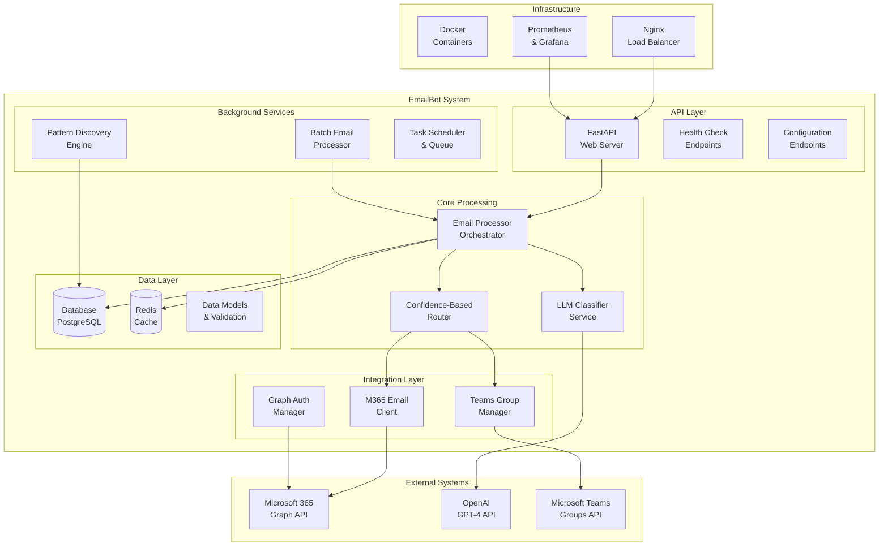
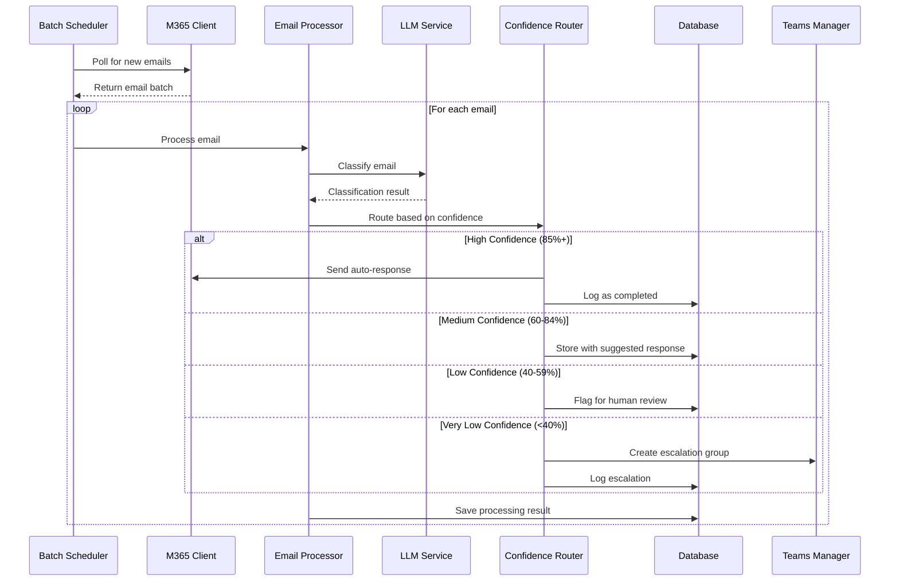
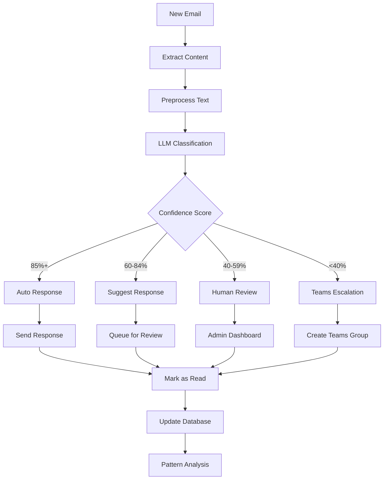
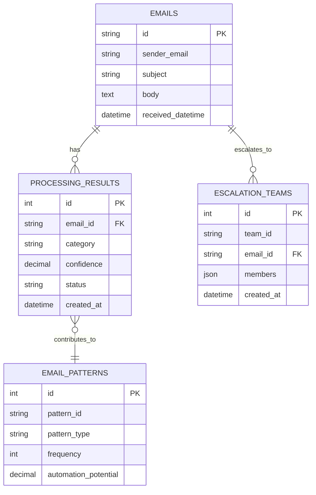
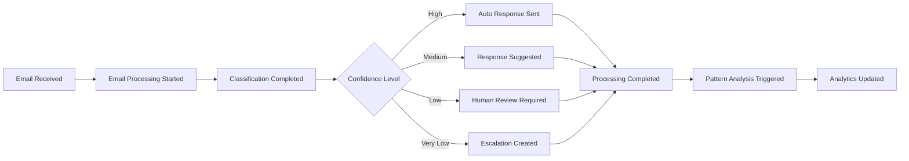

# EmailBot - Architecture Documentation

**Version**: 1.0  
**Last Updated**: January 2025  
**Architecture Level**: System Design

## 🏗️ Architecture Overview

EmailBot is a microservices-oriented application designed for intelligent email processing automation in Microsoft 365 environments. The system follows a modular, event-driven architecture with clear separation of concerns.

## 🎯 System Architecture

### High-Level Architecture Diagram



### Component Overview

| Component | Purpose | Technology | Scalability |
|-----------|---------|------------|-------------|
| **FastAPI Server** | Web API and health endpoints | Python, FastAPI | Horizontal |
| **Email Processor** | Core orchestration logic | Python, asyncio | Vertical |
| **LLM Classifier** | Email classification service | Python, OpenAI API | API-limited |
| **M365 Client** | Microsoft Graph integration | Python, MSAL | API-limited |
| **Teams Manager** | Teams group management | Python, Graph API | API-limited |
| **Pattern Engine** | Pattern discovery and analysis | Python, ML algorithms | Vertical |
| **Database** | Persistent data storage | PostgreSQL | Vertical |
| **Cache** | Performance optimization | Redis | Horizontal |

## 🔄 Data Flow Architecture

### Email Processing Flow



### Data Classification Flow



## 🏛️ Component Architecture

### Core Components

#### 1. Email Processor (Orchestrator)
```python
class EmailProcessor:
    """Central orchestrator for email processing workflow."""
    
    def __init__(
        self,
        llm_service: LLMService,
        m365_client: M365EmailClient,
        confidence_router: ConfidenceRouter,
        database: DatabaseService
    ):
        self.llm_service = llm_service
        self.m365_client = m365_client
        self.confidence_router = confidence_router
        self.database = database
    
    async def process_email(self, email: EmailMessage) -> ProcessingResult:
        """Process single email through complete workflow."""
        # 1. Classify email
        classification = await self.llm_service.classify_email(email)
        
        # 2. Route based on confidence
        action = await self.confidence_router.route(email, classification)
        
        # 3. Execute action
        result = await self._execute_action(email, classification, action)
        
        # 4. Store results
        await self.database.save_processing_result(result)
        
        return result
```

#### 2. LLM Service
```python
class LLMService:
    """OpenAI GPT integration for email classification."""
    
    async def classify_email(self, email: EmailMessage) -> ClassificationResult:
        """Classify email using structured LLM prompts."""
        prompt = self._build_classification_prompt(email)
        response = await self._call_llm(prompt)
        return self._parse_classification_response(response)
    
    async def generate_response(
        self, 
        email: EmailMessage, 
        classification: ClassificationResult
    ) -> str:
        """Generate contextual response suggestion."""
        prompt = self._build_response_prompt(email, classification)
        return await self._call_llm(prompt)
```

#### 3. Confidence Router
```python
class ConfidenceRouter:
    """Routes emails based on classification confidence."""
    
    def __init__(self, thresholds: ConfidenceThresholds):
        self.thresholds = thresholds
    
    async def route(
        self, 
        email: EmailMessage, 
        classification: ClassificationResult
    ) -> RoutingAction:
        """Determine action based on confidence score."""
        confidence = classification.confidence
        
        if confidence >= self.thresholds.auto_handle:
            return RoutingAction.AUTO_RESPOND
        elif confidence >= self.thresholds.suggest_response:
            return RoutingAction.SUGGEST_RESPONSE
        elif confidence >= self.thresholds.human_review:
            return RoutingAction.HUMAN_REVIEW
        else:
            return RoutingAction.ESCALATE
```

### Integration Components

#### 1. Microsoft 365 Integration
```python
class M365EmailClient:
    """Microsoft Graph API integration for email operations."""
    
    async def fetch_new_emails(
        self, 
        since: datetime = None
    ) -> List[EmailMessage]:
        """Fetch unread emails from target mailbox."""
        
    async def send_reply(
        self, 
        original_email: EmailMessage, 
        content: str
    ) -> bool:
        """Send automated reply to email."""
        
    async def mark_as_read(self, email_id: str) -> bool:
        """Mark email as read after processing."""
```

#### 2. Teams Integration
```python
class TeamsManager:
    """Microsoft Teams group management for escalations."""
    
    async def create_escalation_group(
        self,
        email: EmailMessage,
        classification: ClassificationResult,
        team_members: List[str]
    ) -> EscalationTeam:
        """Create Teams group for email escalation."""
        
    async def add_context_message(
        self,
        team_id: str,
        email: EmailMessage,
        analysis: Dict[str, Any]
    ) -> bool:
        """Post email context and analysis to Teams group."""
```

## 💾 Data Architecture

### Database Schema

#### Core Tables
```sql
-- Email processing records
CREATE TABLE emails (
    id VARCHAR(255) PRIMARY KEY,
    sender_email VARCHAR(255) NOT NULL,
    sender_name VARCHAR(255),
    recipient_email VARCHAR(255) NOT NULL,
    subject TEXT NOT NULL,
    body TEXT NOT NULL,
    html_body TEXT,
    received_datetime TIMESTAMP WITH TIME ZONE NOT NULL,
    processed_datetime TIMESTAMP WITH TIME ZONE,
    conversation_id VARCHAR(255),
    importance VARCHAR(50),
    created_at TIMESTAMP WITH TIME ZONE DEFAULT NOW(),
    INDEX idx_received_datetime (received_datetime),
    INDEX idx_sender_email (sender_email),
    INDEX idx_processed_datetime (processed_datetime)
);

-- Classification and processing results
CREATE TABLE processing_results (
    id SERIAL PRIMARY KEY,
    email_id VARCHAR(255) NOT NULL,
    status VARCHAR(50) NOT NULL,
    category VARCHAR(50),
    confidence DECIMAL(5,2),
    reasoning TEXT,
    urgency VARCHAR(20),
    suggested_action TEXT,
    required_expertise JSON,
    estimated_effort VARCHAR(100),
    action_taken VARCHAR(100),
    escalation_id VARCHAR(255),
    response_sent BOOLEAN DEFAULT FALSE,
    processing_time_ms INTEGER,
    error_message TEXT,
    created_at TIMESTAMP WITH TIME ZONE DEFAULT NOW(),
    updated_at TIMESTAMP WITH TIME ZONE DEFAULT NOW(),
    FOREIGN KEY (email_id) REFERENCES emails(id),
    INDEX idx_email_id (email_id),
    INDEX idx_status (status),
    INDEX idx_category (category),
    INDEX idx_confidence (confidence)
);

-- Discovered email patterns
CREATE TABLE email_patterns (
    id SERIAL PRIMARY KEY,
    pattern_id VARCHAR(100) UNIQUE NOT NULL,
    pattern_type VARCHAR(50) NOT NULL,
    description TEXT NOT NULL,
    frequency INTEGER NOT NULL,
    first_seen TIMESTAMP WITH TIME ZONE NOT NULL,
    last_seen TIMESTAMP WITH TIME ZONE NOT NULL,
    automation_potential DECIMAL(5,2) NOT NULL,
    sample_emails JSON,
    created_at TIMESTAMP WITH TIME ZONE DEFAULT NOW(),
    updated_at TIMESTAMP WITH TIME ZONE DEFAULT NOW(),
    INDEX idx_pattern_type (pattern_type),
    INDEX idx_frequency (frequency),
    INDEX idx_automation_potential (automation_potential)
);

-- Teams escalation tracking
CREATE TABLE escalation_teams (
    id SERIAL PRIMARY KEY,
    team_id VARCHAR(255) UNIQUE NOT NULL,
    email_id VARCHAR(255) NOT NULL,
    team_name VARCHAR(255) NOT NULL,
    members JSON NOT NULL,
    created_at TIMESTAMP WITH TIME ZONE DEFAULT NOW(),
    resolved_at TIMESTAMP WITH TIME ZONE,
    resolution_notes TEXT,
    FOREIGN KEY (email_id) REFERENCES emails(id),
    INDEX idx_team_id (team_id),
    INDEX idx_email_id (email_id),
    INDEX idx_created_at (created_at)
);
```

#### Data Relationships


### Caching Strategy

#### Redis Cache Structure
```python
# Email classification cache
email_classification:{email_hash} = {
    "classification": ClassificationResult,
    "expires_at": timestamp,
    "cache_version": "1.0"
}

# LLM response cache
llm_response:{prompt_hash} = {
    "response": "LLM response text",
    "model": "gpt-4",
    "expires_at": timestamp
}

# Pattern analysis cache
pattern_analysis:{date_range} = {
    "patterns": List[EmailPattern],
    "generated_at": timestamp,
    "expires_at": timestamp
}

# Rate limiting
rate_limit:{service}:{key} = {
    "count": request_count,
    "window_start": timestamp,
    "expires_at": timestamp
}
```

## 🔐 Security Architecture

### Authentication & Authorization

#### Microsoft 365 Authentication
```python
class GraphAuthManager:
    """Manages M365 authentication with automatic token refresh."""
    
    async def get_access_token(self) -> str:
        """Get valid access token with automatic refresh."""
        
    async def validate_permissions(self) -> Dict[str, bool]:
        """Validate required Graph API permissions."""
```

#### API Security
```python
class SecurityMiddleware:
    """Security middleware for API protection."""
    
    async def validate_api_key(self, request: Request) -> bool:
        """Validate API key for protected endpoints."""
        
    async def rate_limit_check(self, request: Request) -> bool:
        """Check rate limits per client/endpoint."""
        
    async def audit_log(self, request: Request, response: Response):
        """Log all API access for audit trail."""
```

### Data Protection

#### Encryption Strategy
- **Data at Rest**: Database encryption using PostgreSQL TDE
- **Data in Transit**: TLS 1.3 for all external communications
- **Sensitive Data**: Application-level encryption for email content
- **Secrets Management**: Environment variables with secure storage

#### Privacy Controls
```python
class DataPrivacyService:
    """Handle data privacy and retention requirements."""
    
    async def anonymize_email_content(self, email: EmailMessage) -> EmailMessage:
        """Remove PII from email content for analysis."""
        
    async def apply_retention_policy(self, cutoff_date: datetime):
        """Delete old data according to retention policy."""
```

## 🚀 Performance Architecture

### Scalability Strategy

#### Horizontal Scaling
- **API Layer**: Multiple FastAPI instances behind load balancer
- **Background Processing**: Distributed task queue with Redis
- **Database**: Read replicas for query scaling
- **Cache**: Redis cluster for distributed caching

#### Vertical Scaling
- **LLM Processing**: Optimized prompt engineering and caching
- **Database Queries**: Indexing and query optimization
- **Memory Management**: Efficient object lifecycle management

### Performance Optimization

#### Asynchronous Processing
```python
class AsyncEmailProcessor:
    """Asynchronous email processing for high throughput."""
    
    async def process_batch(
        self, 
        emails: List[EmailMessage]
    ) -> List[ProcessingResult]:
        """Process multiple emails concurrently."""
        tasks = [self.process_email(email) for email in emails]
        return await asyncio.gather(*tasks, return_exceptions=True)
        
    async def process_with_circuit_breaker(
        self, 
        email: EmailMessage
    ) -> ProcessingResult:
        """Process with circuit breaker for fault tolerance."""
```

#### Caching Strategy
```python
class CacheManager:
    """Intelligent caching for performance optimization."""
    
    async def get_or_compute_classification(
        self, 
        email: EmailMessage
    ) -> ClassificationResult:
        """Get cached classification or compute new one."""
        cache_key = self._generate_cache_key(email)
        
        cached = await self.redis.get(cache_key)
        if cached:
            return ClassificationResult.parse_obj(cached)
            
        result = await self.llm_service.classify_email(email)
        await self.redis.setex(
            cache_key, 
            self.cache_ttl, 
            result.json()
        )
        return result
```

## 🔄 Event-Driven Architecture

### Event Flow


### Event Processing
```python
class EventProcessor:
    """Process system events for analytics and monitoring."""
    
    async def handle_email_processed(
        self, 
        event: EmailProcessedEvent
    ):
        """Handle email processing completion event."""
        await self.update_metrics(event)
        await self.trigger_pattern_analysis(event)
        await self.update_confidence_tracking(event)
        
    async def handle_escalation_created(
        self, 
        event: EscalationCreatedEvent
    ):
        """Handle escalation creation event."""
        await self.notify_team_members(event)
        await self.track_escalation_metrics(event)
```

## 📊 Monitoring Architecture

### Health Monitoring
```python
class HealthMonitor:
    """Comprehensive system health monitoring."""
    
    async def check_system_health(self) -> HealthStatus:
        """Check all system components health."""
        checks = await asyncio.gather(
            self.check_database_health(),
            self.check_redis_health(),
            self.check_m365_connectivity(),
            self.check_openai_connectivity(),
            return_exceptions=True
        )
        return self._aggregate_health_status(checks)
```

### Metrics Collection
```python
class MetricsCollector:
    """Collect and expose system metrics."""
    
    def record_email_processed(
        self, 
        category: str, 
        confidence: float, 
        processing_time: float
    ):
        """Record email processing metrics."""
        
    def record_api_request(
        self, 
        endpoint: str, 
        status_code: int, 
        response_time: float
    ):
        """Record API request metrics."""
```

## 🏗️ Deployment Architecture

### Container Architecture
```dockerfile
# Multi-stage production build
FROM python:3.11-slim as builder
# ... build dependencies ...

FROM python:3.11-slim as runtime
# ... runtime setup ...
# Non-root user, health checks, etc.
```

### Infrastructure as Code
```yaml
# docker-compose.prod.yml
version: '3.8'
services:
  emailbot:
    image: emailbot:latest
    deploy:
      replicas: 3
      resources:
        limits:
          cpus: '2.0'
          memory: 4G
    healthcheck:
      test: ["CMD", "curl", "-f", "http://localhost:8000/health"]
      interval: 30s
      timeout: 10s
      retries: 3
```

## 🔮 Future Architecture Considerations

### Planned Enhancements

#### 1. Microservices Decomposition
- Split LLM service into separate microservice
- Dedicated pattern discovery service
- Separate authentication service

#### 2. Event Streaming
- Apache Kafka for event streaming
- Real-time analytics pipeline
- Event sourcing for audit trail

#### 3. Machine Learning Pipeline
- Custom ML models for classification
- A/B testing framework for model comparison
- Continuous learning from feedback

#### 4. Advanced Integrations
- Webhook support for real-time processing
- Multiple LLM provider support
- Custom rule engine for business logic

---

**Document Status**: Current Architecture  
**Next Review**: Quarterly architecture review  
**Maintained By**: Architecture Team 