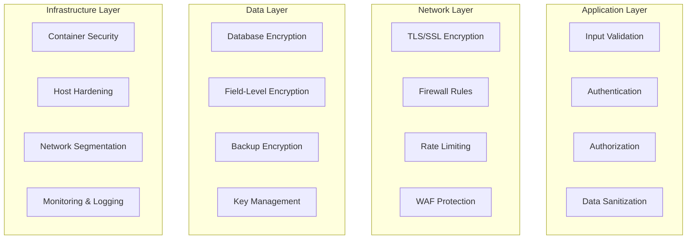

# EmailBot - Security Implementation Guide

**Version**: 1.0  
**Last Updated**: January 2025  
**Purpose**: Comprehensive security measures, audit procedures, and compliance guidelines

## 🔒 Security Overview

This guide provides detailed security implementation guidelines for EmailBot, including data protection, access controls, audit procedures, and compliance requirements.

## 🛡️ Security Architecture

### Defense in Depth Strategy



### Security Principles
1. **Zero Trust**: Never trust, always verify
2. **Least Privilege**: Minimum required access
3. **Defense in Depth**: Multiple security layers
4. **Continuous Monitoring**: Real-time threat detection
5. **Data Minimization**: Collect only necessary data
6. **Encryption Everywhere**: Protect data in transit and at rest

## 🔐 Authentication and Authorization

### Multi-Factor Authentication Implementation

#### M365 Service Authentication
```python
from msal import ConfidentialClientApplication
from cryptography.fernet import Fernet
import secrets
import hashlib

class SecureAuthManager:
    """Enhanced authentication manager with security controls."""
    
    def __init__(self, tenant_id: str, client_id: str, client_secret: str):
        self.tenant_id = tenant_id
        self.client_id = client_id
        self.client_secret = client_secret
        
        # Security enhancements
        self.max_token_age = 3600  # 1 hour
        self.failed_attempts = {}
        self.lockout_threshold = 5
        self.lockout_duration = 900  # 15 minutes
        
        # Initialize MSAL with security configurations
        self.app = ConfidentialClientApplication(
            client_id=client_id,
            client_credential=client_secret,
            authority=f"https://login.microsoftonline.com/{tenant_id}",
            # Security configurations
            validate_authority=True,
            instance_discovery=True
        )
    
    async def authenticate_with_validation(self) -> dict:
        """Authenticate with enhanced security validation."""
        try:
            # Check for lockout
            if self._is_locked_out():
                raise SecurityException("Authentication temporarily locked due to failed attempts")
            
            # Perform authentication
            result = self.app.acquire_token_for_client(
                scopes=["https://graph.microsoft.com/.default"]
            )
            
            if "access_token" not in result:
                self._record_failed_attempt()
                raise AuthenticationError(f"Authentication failed: {result.get('error_description')}")
            
            # Validate token
            token_validation = await self._validate_token_security(result["access_token"])
            if not token_validation["valid"]:
                raise SecurityException(f"Token validation failed: {token_validation['reason']}")
            
            # Reset failed attempts on success
            self._reset_failed_attempts()
            
            return result
            
        except Exception as e:
            self._record_failed_attempt()
            logger.error(f"Authentication failed: {str(e)}")
            raise
    
    async def _validate_token_security(self, token: str) -> dict:
        """Validate token security properties."""
        import jwt
        
        try:
            # Decode without verification to inspect claims
            unverified = jwt.decode(token, options={"verify_signature": False})
            
            validations = {
                "valid": True,
                "reason": None,
                "checks": {}
            }
            
            # Check token expiration
            exp = unverified.get("exp", 0)
            current_time = time.time()
            if exp <= current_time:
                validations["valid"] = False
                validations["reason"] = "Token expired"
                return validations
            
            # Check audience
            aud = unverified.get("aud")
            if aud != "https://graph.microsoft.com":
                validations["valid"] = False
                validations["reason"] = "Invalid audience"
                return validations
            
            # Check issuer
            iss = unverified.get("iss")
            if not iss or not iss.startswith("https://sts.windows.net/"):
                validations["valid"] = False
                validations["reason"] = "Invalid issuer"
                return validations
            
            validations["checks"] = {
                "expiration": "valid",
                "audience": "valid",
                "issuer": "valid"
            }
            
            return validations
            
        except Exception as e:
            return {
                "valid": False,
                "reason": f"Token validation error: {str(e)}",
                "checks": {}
            }
```

### API Key Management
```python
class APIKeyManager:
    """Secure API key management with rotation and validation."""
    
    def __init__(self, encryption_key: str):
        self.fernet = Fernet(encryption_key.encode())
        self.key_store = {}
        self.key_metadata = {}
    
    def generate_api_key(self, user_id: str, permissions: List[str]) -> str:
        """Generate secure API key with metadata."""
        # Generate cryptographically secure random key
        key_bytes = secrets.token_bytes(32)
        key_string = base64.urlsafe_b64encode(key_bytes).decode()
        
        # Create key metadata
        key_id = hashlib.sha256(key_string.encode()).hexdigest()[:16]
        metadata = {
            "user_id": user_id,
            "permissions": permissions,
            "created_at": datetime.utcnow().isoformat(),
            "expires_at": (datetime.utcnow() + timedelta(days=90)).isoformat(),
            "revoked": False,
            "last_used": None,
            "usage_count": 0
        }
        
        # Store encrypted metadata
        encrypted_metadata = self.fernet.encrypt(json.dumps(metadata).encode())
        self.key_metadata[key_id] = encrypted_metadata
        
        # Return prefixed key
        return f"eb_{key_id}_{key_string}"
    
    async def validate_api_key(self, api_key: str) -> dict:
        """Validate API key and return permissions."""
        try:
            # Parse key format
            if not api_key.startswith("eb_"):
                return {"valid": False, "reason": "Invalid key format"}
            
            parts = api_key.split("_", 2)
            if len(parts) != 3:
                return {"valid": False, "reason": "Invalid key structure"}
            
            key_id = parts[1]
            
            # Get metadata
            if key_id not in self.key_metadata:
                return {"valid": False, "reason": "Key not found"}
            
            encrypted_metadata = self.key_metadata[key_id]
            metadata_json = self.fernet.decrypt(encrypted_metadata).decode()
            metadata = json.loads(metadata_json)
            
            # Check expiration
            expires_at = datetime.fromisoformat(metadata["expires_at"])
            if datetime.utcnow() > expires_at:
                return {"valid": False, "reason": "Key expired"}
            
            # Check revocation
            if metadata["revoked"]:
                return {"valid": False, "reason": "Key revoked"}
            
            # Update usage tracking
            metadata["last_used"] = datetime.utcnow().isoformat()
            metadata["usage_count"] += 1
            
            # Re-encrypt and store updated metadata
            encrypted_metadata = self.fernet.encrypt(json.dumps(metadata).encode())
            self.key_metadata[key_id] = encrypted_metadata
            
            return {
                "valid": True,
                "user_id": metadata["user_id"],
                "permissions": metadata["permissions"],
                "metadata": {
                    "created_at": metadata["created_at"],
                    "usage_count": metadata["usage_count"],
                    "last_used": metadata["last_used"]
                }
            }
            
        except Exception as e:
            logger.error(f"API key validation error: {str(e)}")
            return {"valid": False, "reason": "Validation error"}
```

## 🔒 Data Protection

### Data Classification System
```python
from enum import Enum
from typing import Dict, Any, List

class DataClassification(Enum):
    """Data sensitivity classifications."""
    PUBLIC = "public"
    INTERNAL = "internal"
    CONFIDENTIAL = "confidential"
    RESTRICTED = "restricted"

class DataProtectionManager:
    """Comprehensive data protection implementation."""
    
    def __init__(self, encryption_key: str):
        self.encryption_key = encryption_key
        self.fernet = Fernet(encryption_key.encode())
        
        # PII detection patterns
        self.pii_patterns = {
            "SSN": r'\b\d{3}-?\d{2}-?\d{4}\b',
            "CREDIT_CARD": r'\b\d{4}[- ]?\d{4}[- ]?\d{4}[- ]?\d{4}\b',
            "EMAIL": r'\b[A-Za-z0-9._%+-]+@[A-Za-z0-9.-]+\.[A-Z|a-z]{2,}\b',
            "PHONE": r'\b(\+1[-.\s]?)?\(?\d{3}\)?[-.\s]?\d{3}[-.\s]?\d{4}\b',
            "IP_ADDRESS": r'\b\d{1,3}\.\d{1,3}\.\d{1,3}\.\d{1,3}\b'
        }
        
        # Data handling policies by classification
        self.policies = {
            DataClassification.PUBLIC: {
                "encryption_required": False,
                "access_logging": False,
                "retention_days": 365
            },
            DataClassification.INTERNAL: {
                "encryption_required": True,
                "access_logging": True,
                "retention_days": 180
            },
            DataClassification.CONFIDENTIAL: {
                "encryption_required": True,
                "access_logging": True,
                "retention_days": 90,
                "approval_required": True
            },
            DataClassification.RESTRICTED: {
                "encryption_required": True,
                "access_logging": True,
                "retention_days": 30,
                "approval_required": True,
                "audit_trail": True
            }
        }
    
    async def classify_email_content(self, email_content: str) -> Dict[str, Any]:
        """Classify email content based on sensitivity."""
        classification_result = {
            "classification": DataClassification.INTERNAL,
            "confidence": 0.8,
            "detected_pii": [],
            "risk_factors": [],
            "recommended_actions": []
        }
        
        # Detect PII
        detected_pii = []
        for pii_type, pattern in self.pii_patterns.items():
            matches = re.findall(pattern, email_content, re.IGNORECASE)
            if matches:
                detected_pii.append({
                    "type": pii_type,
                    "count": len(matches),
                    "examples": matches[:2]  # Only first 2 examples for security
                })
        
        classification_result["detected_pii"] = detected_pii
        
        # Determine classification based on PII and content
        if any(pii["type"] in ["SSN", "CREDIT_CARD"] for pii in detected_pii):
            classification_result["classification"] = DataClassification.RESTRICTED
            classification_result["confidence"] = 0.95
            classification_result["risk_factors"].append("High-sensitivity PII detected")
        elif detected_pii:
            classification_result["classification"] = DataClassification.CONFIDENTIAL
            classification_result["confidence"] = 0.85
            classification_result["risk_factors"].append("PII detected")
        
        # Check for sensitive keywords
        sensitive_keywords = [
            "password", "credential", "secret", "private key", "confidential",
            "financial", "salary", "medical", "legal", "attorney"
        ]
        
        content_lower = email_content.lower()
        found_keywords = [kw for kw in sensitive_keywords if kw in content_lower]
        
        if found_keywords:
            if classification_result["classification"] == DataClassification.INTERNAL:
                classification_result["classification"] = DataClassification.CONFIDENTIAL
                classification_result["confidence"] = 0.75
            classification_result["risk_factors"].append(f"Sensitive keywords: {', '.join(found_keywords[:3])}")
        
        # Generate recommendations
        policy = self.policies[classification_result["classification"]]
        if policy["encryption_required"]:
            classification_result["recommended_actions"].append("Apply encryption")
        if policy["access_logging"]:
            classification_result["recommended_actions"].append("Enable access logging")
        if policy.get("approval_required"):
            classification_result["recommended_actions"].append("Require approval for access")
        
        return classification_result
    
    async def sanitize_content(self, content: str, classification: DataClassification) -> Dict[str, Any]:
        """Sanitize content based on classification level."""
        sanitized_content = content
        sanitization_log = []
        
        # Apply sanitization based on classification
        if classification in [DataClassification.CONFIDENTIAL, DataClassification.RESTRICTED]:
            # Replace PII with placeholders
            for pii_type, pattern in self.pii_patterns.items():
                matches = re.findall(pattern, sanitized_content)
                if matches:
                    placeholder = f"[{pii_type}_REDACTED]"
                    sanitized_content = re.sub(pattern, placeholder, sanitized_content)
                    sanitization_log.append(f"Replaced {len(matches)} {pii_type} instances")
        
        # Truncate if too long
        max_length = 5000 if classification == DataClassification.RESTRICTED else 10000
        if len(sanitized_content) > max_length:
            sanitized_content = sanitized_content[:max_length] + "[TRUNCATED]"
            sanitization_log.append(f"Content truncated to {max_length} characters")
        
        return {
            "sanitized_content": sanitized_content,
            "original_length": len(content),
            "sanitized_length": len(sanitized_content),
            "sanitization_actions": sanitization_log
        }
    
    async def encrypt_sensitive_data(self, data: str, classification: DataClassification) -> str:
        """Encrypt data based on classification requirements."""
        policy = self.policies[classification]
        
        if policy["encryption_required"]:
            return self.fernet.encrypt(data.encode()).decode()
        return data
    
    async def decrypt_sensitive_data(self, encrypted_data: str, classification: DataClassification) -> str:
        """Decrypt data with proper authorization."""
        policy = self.policies[classification]
        
        if policy["encryption_required"]:
            return self.fernet.decrypt(encrypted_data.encode()).decode()
        return encrypted_data
```

### Secure Data Storage
```python
class SecureDataStore:
    """Secure data storage with encryption and access controls."""
    
    def __init__(self, database_url: str, encryption_key: str):
        self.database_url = database_url
        self.encryption_key = encryption_key
        self.fernet = Fernet(encryption_key.encode())
    
    async def store_email_securely(self, email_data: Dict[str, Any]) -> str:
        """Store email with appropriate security measures."""
        # Classify email content
        classification_result = await data_protection.classify_email_content(
            email_data["body"]
        )
        
        classification = classification_result["classification"]
        
        # Sanitize content
        sanitization_result = await data_protection.sanitize_content(
            email_data["body"], classification
        )
        
        # Apply encryption if required
        encrypted_body = await data_protection.encrypt_sensitive_data(
            sanitization_result["sanitized_content"], classification
        )
        
        # Store with metadata
        storage_record = {
            "email_id": email_data["id"],
            "sender_email": email_data["sender_email"],
            "subject": email_data["subject"],
            "body": encrypted_body,
            "classification": classification.value,
            "pii_detected": classification_result["detected_pii"],
            "sanitization_log": sanitization_result["sanitization_actions"],
            "created_at": datetime.utcnow().isoformat(),
            "access_policy": self.policies[classification]
        }
        
        # Log access for audit trail
        await self._log_data_access("STORE", email_data["id"], classification)
        
        return await self._store_record(storage_record)
    
    async def retrieve_email_securely(
        self, 
        email_id: str, 
        user_id: str, 
        permissions: List[str]
    ) -> Dict[str, Any]:
        """Retrieve email with security validation."""
        # Get stored record
        record = await self._get_record(email_id)
        if not record:
            raise DataNotFoundError(f"Email {email_id} not found")
        
        classification = DataClassification(record["classification"])
        policy = self.policies[classification]
        
        # Check access permissions
        if not await self._validate_access_permissions(user_id, permissions, classification):
            await self._log_data_access("DENIED", email_id, classification, user_id)
            raise AccessDeniedError(f"Insufficient permissions for {classification.value} data")
        
        # Decrypt if necessary
        decrypted_body = await data_protection.decrypt_sensitive_data(
            record["body"], classification
        )
        
        # Log successful access
        await self._log_data_access("RETRIEVE", email_id, classification, user_id)
        
        return {
            "email_id": record["email_id"],
            "sender_email": record["sender_email"],
            "subject": record["subject"],
            "body": decrypted_body,
            "classification": classification.value,
            "access_metadata": {
                "accessed_by": user_id,
                "accessed_at": datetime.utcnow().isoformat(),
                "classification": classification.value
            }
        }
```

## 🔍 Security Monitoring and Auditing

### Comprehensive Audit System
```python
class SecurityAuditor:
    """Comprehensive security auditing and monitoring."""
    
    def __init__(self, audit_database: str, alert_manager: Any):
        self.audit_db = audit_database
        self.alert_manager = alert_manager
        self.monitoring_rules = self._load_monitoring_rules()
    
    async def log_security_event(
        self, 
        event_type: str, 
        user_id: str = None, 
        resource: str = None, 
        details: Dict[str, Any] = None,
        risk_level: str = "low"
    ):
        """Log security event with structured data."""
        event_id = str(uuid.uuid4())
        timestamp = datetime.utcnow()
        
        audit_entry = {
            "event_id": event_id,
            "timestamp": timestamp.isoformat(),
            "event_type": event_type,
            "user_id": user_id,
            "resource": resource,
            "details": details or {},
            "risk_level": risk_level,
            "source_ip": self._get_client_ip(),
            "user_agent": self._get_user_agent(),
            "session_id": self._get_session_id()
        }
        
        # Store audit entry
        await self._store_audit_entry(audit_entry)
        
        # Check for security patterns
        await self._analyze_security_patterns(audit_entry)
        
        # Trigger alerts if necessary
        if risk_level in ["high", "critical"]:
            await self._trigger_security_alert(audit_entry)
    
    async def _analyze_security_patterns(self, event: Dict[str, Any]):
        """Analyze event for suspicious patterns."""
        suspicious_patterns = []
        
        # Check for rapid failed login attempts
        if event["event_type"] == "authentication_failed":
            recent_failures = await self._count_recent_events(
                "authentication_failed",
                user_id=event["user_id"],
                minutes=5
            )
            
            if recent_failures >= 5:
                suspicious_patterns.append({
                    "pattern": "brute_force_attack",
                    "severity": "high",
                    "description": f"{recent_failures} failed login attempts in 5 minutes"
                })
        
        # Check for unusual access times
        if event["event_type"] == "data_access":
            hour = datetime.fromisoformat(event["timestamp"]).hour
            if hour < 6 or hour > 22:  # Outside business hours
                suspicious_patterns.append({
                    "pattern": "unusual_access_time",
                    "severity": "medium",
                    "description": f"Data access at {hour}:00"
                })
        
        # Check for privilege escalation
        if event["event_type"] == "permission_change":
            details = event.get("details", {})
            if details.get("permission_level_increased"):
                suspicious_patterns.append({
                    "pattern": "privilege_escalation",
                    "severity": "high",
                    "description": "User permissions elevated"
                })
        
        # Log suspicious patterns
        for pattern in suspicious_patterns:
            await self.log_security_event(
                "suspicious_pattern_detected",
                user_id=event.get("user_id"),
                details={
                    "original_event": event["event_id"],
                    "pattern": pattern
                },
                risk_level=pattern["severity"]
            )
    
    async def generate_security_report(self, days: int = 30) -> Dict[str, Any]:
        """Generate comprehensive security report."""
        end_date = datetime.utcnow()
        start_date = end_date - timedelta(days=days)
        
        # Get audit events
        events = await self._get_audit_events(start_date, end_date)
        
        report = {
            "report_period": {
                "start": start_date.isoformat(),
                "end": end_date.isoformat(),
                "days": days
            },
            "summary": {
                "total_events": len(events),
                "unique_users": len(set(e.get("user_id") for e in events if e.get("user_id"))),
                "high_risk_events": len([e for e in events if e.get("risk_level") == "high"]),
                "critical_events": len([e for e in events if e.get("risk_level") == "critical"])
            },
            "event_breakdown": {},
            "user_activity": {},
            "security_incidents": [],
            "recommendations": []
        }
        
        # Event type breakdown
        event_types = {}
        for event in events:
            event_type = event["event_type"]
            if event_type not in event_types:
                event_types[event_type] = 0
            event_types[event_type] += 1
        report["event_breakdown"] = event_types
        
        # User activity analysis
        user_activity = {}
        for event in events:
            user_id = event.get("user_id")
            if user_id:
                if user_id not in user_activity:
                    user_activity[user_id] = {
                        "total_events": 0,
                        "failed_logins": 0,
                        "data_accesses": 0,
                        "high_risk_events": 0
                    }
                
                user_activity[user_id]["total_events"] += 1
                
                if event["event_type"] == "authentication_failed":
                    user_activity[user_id]["failed_logins"] += 1
                elif event["event_type"] == "data_access":
                    user_activity[user_id]["data_accesses"] += 1
                
                if event.get("risk_level") in ["high", "critical"]:
                    user_activity[user_id]["high_risk_events"] += 1
        
        report["user_activity"] = user_activity
        
        # Security incidents
        incidents = [e for e in events if e.get("risk_level") in ["high", "critical"]]
        report["security_incidents"] = incidents
        
        # Generate recommendations
        recommendations = await self._generate_security_recommendations(events)
        report["recommendations"] = recommendations
        
        return report
```

### Real-time Threat Detection
```python
class ThreatDetector:
    """Real-time threat detection and response."""
    
    def __init__(self, redis_client, alert_manager):
        self.redis = redis_client
        self.alert_manager = alert_manager
        
        # Threat detection rules
        self.rules = {
            "brute_force": {
                "threshold": 5,
                "window_minutes": 5,
                "action": "block_ip"
            },
            "data_exfiltration": {
                "threshold": 100,  # 100 data access events
                "window_minutes": 10,
                "action": "alert_security_team"
            },
            "privilege_abuse": {
                "threshold": 1,
                "window_minutes": 1,
                "action": "immediate_alert"
            }
        }
    
    async def analyze_event(self, event: Dict[str, Any]) -> Dict[str, Any]:
        """Analyze event for threats in real-time."""
        threats_detected = []
        
        # Check each rule
        for rule_name, rule_config in self.rules.items():
            threat_detected = await self._check_rule(event, rule_name, rule_config)
            if threat_detected:
                threats_detected.append(threat_detected)
        
        # Take action for detected threats
        for threat in threats_detected:
            await self._handle_threat(threat, event)
        
        return {
            "threats_detected": threats_detected,
            "actions_taken": [t.get("action_taken") for t in threats_detected]
        }
    
    async def _check_rule(
        self, 
        event: Dict[str, Any], 
        rule_name: str, 
        rule_config: Dict[str, Any]
    ) -> Dict[str, Any]:
        """Check specific threat detection rule."""
        if rule_name == "brute_force" and event["event_type"] == "authentication_failed":
            # Count recent failed attempts from same IP
            source_ip = event.get("source_ip")
            if source_ip:
                key = f"threat:brute_force:{source_ip}"
                count = await self.redis.incr(key)
                await self.redis.expire(key, rule_config["window_minutes"] * 60)
                
                if count >= rule_config["threshold"]:
                    return {
                        "rule": rule_name,
                        "severity": "high",
                        "description": f"Brute force attack detected from {source_ip}",
                        "details": {
                            "failed_attempts": count,
                            "source_ip": source_ip,
                            "window_minutes": rule_config["window_minutes"]
                        },
                        "recommended_action": rule_config["action"]
                    }
        
        elif rule_name == "data_exfiltration" and event["event_type"] == "data_access":
            # Count data access events by user
            user_id = event.get("user_id")
            if user_id:
                key = f"threat:data_access:{user_id}"
                count = await self.redis.incr(key)
                await self.redis.expire(key, rule_config["window_minutes"] * 60)
                
                if count >= rule_config["threshold"]:
                    return {
                        "rule": rule_name,
                        "severity": "critical",
                        "description": f"Potential data exfiltration by {user_id}",
                        "details": {
                            "access_count": count,
                            "user_id": user_id,
                            "window_minutes": rule_config["window_minutes"]
                        },
                        "recommended_action": rule_config["action"]
                    }
        
        return None
    
    async def _handle_threat(self, threat: Dict[str, Any], event: Dict[str, Any]):
        """Handle detected threat with appropriate response."""
        action = threat["recommended_action"]
        
        if action == "block_ip":
            source_ip = threat["details"].get("source_ip")
            if source_ip:
                await self._block_ip_address(source_ip)
                threat["action_taken"] = f"Blocked IP {source_ip}"
        
        elif action == "alert_security_team":
            await self.alert_manager.send_security_alert(
                severity="high",
                message=threat["description"],
                details=threat["details"]
            )
            threat["action_taken"] = "Security team alerted"
        
        elif action == "immediate_alert":
            await self.alert_manager.send_immediate_alert(
                severity="critical",
                message=threat["description"],
                details=threat["details"]
            )
            threat["action_taken"] = "Immediate alert sent"
        
        # Log threat response
        await self._log_threat_response(threat, event)
```

## 🔒 Compliance and Standards

### GDPR Compliance Implementation
```python
class GDPRComplianceManager:
    """GDPR compliance management and enforcement."""
    
    def __init__(self, data_store: SecureDataStore):
        self.data_store = data_store
        self.consent_records = {}
        self.processing_purposes = {
            "email_classification": "Legitimate interest for IT operations",
            "escalation_management": "Legitimate interest for business operations",
            "pattern_analysis": "Legitimate interest for service improvement"
        }
    
    async def record_data_processing(
        self, 
        data_subject: str, 
        purpose: str, 
        legal_basis: str,
        data_categories: List[str]
    ):
        """Record data processing activity for GDPR compliance."""
        processing_record = {
            "data_subject": data_subject,
            "purpose": purpose,
            "legal_basis": legal_basis,
            "data_categories": data_categories,
            "processed_at": datetime.utcnow().isoformat(),
            "retention_period": self._get_retention_period(purpose),
            "processor": "EmailBot System"
        }
        
        await self._store_processing_record(processing_record)
    
    async def handle_data_subject_request(
        self, 
        request_type: str, 
        data_subject: str
    ) -> Dict[str, Any]:
        """Handle GDPR data subject requests."""
        if request_type == "access":
            return await self._handle_access_request(data_subject)
        elif request_type == "portability":
            return await self._handle_portability_request(data_subject)
        elif request_type == "erasure":
            return await self._handle_erasure_request(data_subject)
        elif request_type == "rectification":
            return await self._handle_rectification_request(data_subject)
        else:
            raise ValueError(f"Unsupported request type: {request_type}")
    
    async def _handle_access_request(self, data_subject: str) -> Dict[str, Any]:
        """Handle subject access request."""
        # Find all data for the subject
        personal_data = await self._find_personal_data(data_subject)
        processing_records = await self._find_processing_records(data_subject)
        
        return {
            "data_subject": data_subject,
            "request_type": "access",
            "processed_at": datetime.utcnow().isoformat(),
            "personal_data": personal_data,
            "processing_activities": processing_records,
            "data_categories": list(set(
                cat for record in processing_records 
                for cat in record["data_categories"]
            )),
            "purposes": list(set(
                record["purpose"] for record in processing_records
            )),
            "retention_periods": {
                record["purpose"]: record["retention_period"] 
                for record in processing_records
            }
        }
    
    async def _handle_erasure_request(self, data_subject: str) -> Dict[str, Any]:
        """Handle right to erasure request."""
        # Check if erasure is possible
        legal_obligations = await self._check_legal_obligations(data_subject)
        
        if legal_obligations:
            return {
                "data_subject": data_subject,
                "request_type": "erasure",
                "status": "denied",
                "reason": "Legal obligations prevent erasure",
                "obligations": legal_obligations
            }
        
        # Perform erasure
        deleted_records = await self._delete_personal_data(data_subject)
        
        return {
            "data_subject": data_subject,
            "request_type": "erasure",
            "status": "completed",
            "deleted_records": deleted_records,
            "completed_at": datetime.utcnow().isoformat()
        }
```

### Security Compliance Checklist
```yaml
# Security Compliance Checklist

## Data Protection
- [ ] Data classification system implemented
- [ ] Encryption at rest and in transit
- [ ] PII detection and masking
- [ ] Data retention policies enforced
- [ ] Secure backup procedures

## Access Control
- [ ] Multi-factor authentication
- [ ] Role-based access control
- [ ] Principle of least privilege
- [ ] Regular access reviews
- [ ] Session management

## Monitoring and Auditing
- [ ] Comprehensive audit logging
- [ ] Real-time threat detection
- [ ] Security event monitoring
- [ ] Incident response procedures
- [ ] Regular security assessments

## Compliance
- [ ] GDPR compliance measures
- [ ] Data subject rights procedures
- [ ] Privacy impact assessments
- [ ] Vendor security assessments
- [ ] Regular compliance audits

## Infrastructure Security
- [ ] Container security scanning
- [ ] Network segmentation
- [ ] Firewall configuration
- [ ] SSL/TLS implementation
- [ ] Security patches current
```

---

**Document Status**: Security Ready  
**Last Updated**: January 2025  
**Next Review**: Monthly security review 